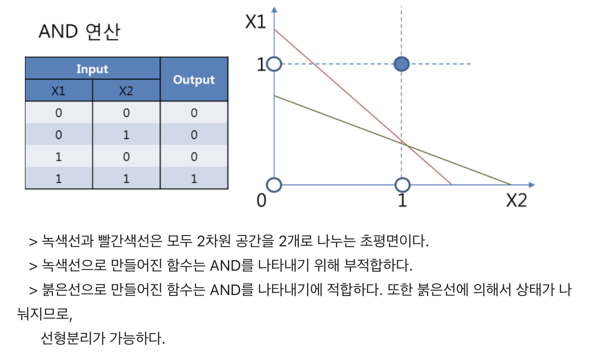
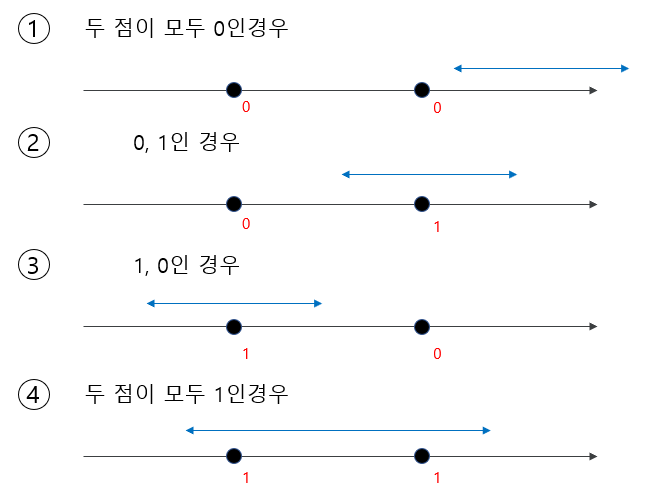
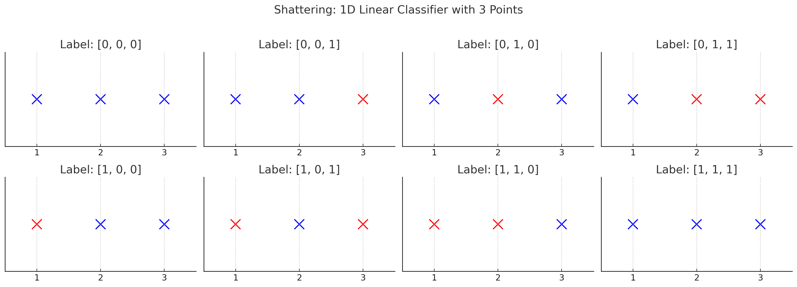

3주차 GMM

- [Class 1](#class-1)
    - [📌 What is Machine Learning?](#-what-is-machine-learning)
      - [1. CS vs ML](#1-cs-vs-ml)
      - [2. Components of Machine Learning](#2-components-of-machine-learning)
    - [📌 Perceptron](#-perceptron)
      - [1. Provable Convergence Properties ( 증명 가능한 수렴 성질 )](#1-provable-convergence-properties--증명-가능한-수렴-성질-)
      - [2. How This Improved?](#2-how-this-improved)
    - [📌 ML vs AI](#-ml-vs-ai)
      - [1. Compare of ML, AI](#1-compare-of-ml-ai)
      - [2.Examples](#2examples)
    - [📌 Methods of Learning](#-methods-of-learning)
      - [1. Compare of Methods](#1-compare-of-methods)
      - [2. How Supervised Learning Operate?](#2-how-supervised-learning-operate)
          - [Setup](#setup)
          - [Examples of $\\mathcal{Y}$](#examples-of-mathcaly)
          - [Examples of $\\mathcal{X}$](#examples-of-mathcalx)
- [Class 2](#class-2)
    - [📌 Hypothesis Class](#-hypothesis-class)
      - [1. What is Hypothesis Class?](#1-what-is-hypothesis-class)
      - [2. Examples of Hypothesis Class](#2-examples-of-hypothesis-class)
          - [2-1. 선형 이진 분류기](#2-1-선형-이진-분류기)
          - [2-2. 다항 회귀](#2-2-다항-회귀)
          - [2-3. CNN](#2-3-cnn)
      - [3. VC 차원을 이용한 복잡도 측정](#3-vc-차원을-이용한-복잡도-측정)
          - [3-1. VC 차원이란?](#3-1-vc-차원이란)
          - [3-2. Generalization Bound](#3-2-generalization-bound)
    - [📌 Loss Function](#-loss-function)
      - [1. Defintion of Loss Function](#1-defintion-of-loss-function)
      - [2. Examples of Loss Function](#2-examples-of-loss-function)
          - [2-1. 1/0 loss](#2-1-10-loss)
          - [2-2. Square Loss](#2-2-square-loss)
          - [2-3. Absolute Loss](#2-3-absolute-loss)
      - [3. Train / Test Data Split](#3-train--test-data-split)
    - [📌 Example Of Doing Supervised Learning](#-example-of-doing-supervised-learning)
      - [1. Data Preprocess](#1-data-preprocess)
      - [2. Train / Test Split](#2-train--test-split)
      - [3. Justify Model](#3-justify-model)
      - [4. Justify Optimizer](#4-justify-optimizer)
      - [5. Learn](#5-learn)
      - [6. Evaluate Model](#6-evaluate-model)

# Class 1

### 📌 What is Machine Learning?

#### 1. CS vs ML
|정통 Computer Science|Machine Learning|
|---|---|
|Data + Program -> Computer -> Output|Data + Output -> Computer -> Program -> Computer -> Output|

> More data -> Better Program
>> The reason ML contains "Learning"

#### 2. Components of Machine Learning

1️⃣ E (Expreince) like data..

2️⃣ T (Task) 목표

3️⃣ P (Perfomance) 목표를 위한 성능지표

> "Algorithms that improve on some task with expreince"

### 📌 Perceptron

#### 1. Provable Convergence Properties ( 증명 가능한 수렴 성질 )

> Perceptron은 Provable한 수렴 성질을 가진다.
> 그러면 이게 무슨 뜻일까?

✅ 추가 탐구

Perceptron은 데이터가 선형 분리 가능 (linearly sparable) 할 때만 수렴이 증명된다.

✅ 선형 분리 가능하다는 것은?

❗️직관적 정의 : 하나의 직선 (혹은 초평면)으로 두 클래스를 완벽히 나눌 수 있다는 것을 뜻한다.

> ex) AND 연산이 여기에 해당한다.

출처 : [[인공지능] 인공신경망(ANN:Artificial Nerual Network) Part 2](https://destiny738.tistory.com/455)

❗️수학적 정의

데이터
$$
D = \{(x_1, y_1), (x_2, y_2), ... , (x_N, y_N)\}
$$

이 주어졌을 때, 각 $x_i \in \mathbb{R}^n, y_i \in \{  -1, +1\}$ 라고 하자.
 
 
 
이 데이터 셋이 선형 분리 가능하다는 것은,

어떤 가중치 벡터 $\vec{w}\in\mathbb{R}^n$, 그리고 $ b \in \mathbb{R}$가 존재해서 아래 조건을 모든 데이터에 대해 만족하는 경우에 해당한다.

$$y_i (\vec{w}^{\top} \vec{x_i} + b) > 0, \forall i = 1,...,N$$

간단하게 2차원의 경우에, 모델을 $ y = wx + b$로 정의할 수 있는데, 이 경우에는 $x = -\frac{b}{w}$를 기준으로 클래스가 +1인 데이터가 모두 왼쪽에 있거나 오른쪽에 있을 때, 선형 분리 가능하다고 한다.

또한, $-\frac{b}{w}$를 결정 경계 (Decision Boundary)
라고한다.

💭 참고 1 : $\vec{w}^{\top}$ (전치 행렬)을 만드는 이유는 행렬곱을 위해서임.

💭 참고 2 : 퍼셉트론은 이진 분류만 시행하기 때문에 -1, +1로 클래스를 둘 수 있는 것임.

💭 참고 3 : $\vec{w}^{\top} \vec{x_i}$를 초평면이라고 하며, 2차원의 경우에는 직선, 3차원의 경우에는 평면이 된다.

💭 ex) 2차원의 초평면은 $ax + by + c = 0$

💭 일반화하면, n차원의 초평면은 $a_1x_1 + a_2x_2 + ... + a_nx_n$

즉, 이 경우에는 학습이 무한히 반복되지 않으며 정해진 횟수안에 수렴하게 된다.

#### 2. How This Improved?

> ANN (Artifcial Nerual Network)

> Deep Learning

### 📌 ML vs AI

#### 1. Compare of ML, AI

|ML|AI|
|---|---|
|Bottum-Up|Top-Down|
|데이터-패턴-결론|목표설정-해결방법찾기|
|통계 + 최적화 중심|like Rule Based Machine|
|uncertantiy를 처리할 수 있음.|uncertantiy를 처리할 수 없음.|

#### 2.Examples

2-1. game-bot

2-2. spam filter

2-3. web search

### 📌 Methods of Learning

#### 1. Compare of Methods

|Supervised Learning|Unsupervised Learning|Reinforcement Learning|
|---|---|---|
|지도학습|비지도학습|강화학습|
|labled examples|find patterns|delayed feedback|

#### 2. How Supervised Learning Operate?

###### Setup

$$Data = \{(\vec{x_1}, y_1), ... ,(\vec{x_n}, y_n)\} \le\mathcal{X}, \mathcal{Y}$$

$$(\mathcal{X} \sim \mathbb{R^d}, \mathcal{Y}는 예측목표)$$

$$(\vec{x_n}, y_n)\sim \mathcal{P}$$

###### Examples of $\mathcal{Y}$

이진 분류
$$\mathcal{Y} = \{0, 1\}$$
$$\mathcal{Y} = \{-1, +1\}$$

다중 분류
$$\mathcal{Y} = \{1, ..., k\}$$

회귀 모델 
$$\mathcal{Y} = \mathbb{R}$$

###### Examples of $\mathcal{X}$

이진 분류

$$\vec{x_n} = \begin{bmatrix} 1 \\ 62 \\ 182 \\ . \\.\\.\end{bmatrix}$$
(특징 벡터)

# Class 2

### 📌 Hypothesis Class

#### 1. What is Hypothesis Class?

그니깐, 어떤 인공지능 모델을 만들기 위해 가능한 함수들의 집합임.

이걸 잘 설정하는 것이 인공지능 모델의 핵심임.

한글로는, 가설 집합이라고도 함.

예를 들어, 어떤 데이터를 단순히 선형 분류만 진행할 수 있지만, 다항 분류를 사용하면 모델의 함수가 달라지게 됨.

> 선형 분류의 경우 $h(x) = ax+b$

> 다항 분류의 경우 $h(x) = w_nx^n + ... + w_1x + b$ 

일반적으로 선형 분류 모델을 사용하면 구해야할 가중치의 수가 줄어들어 빠른 학습이 가능하지만, 그만큼 정확도는 떨어지며, 다항 분류를 사용하면 정확도는 높아지지만, 구해야할 가중치의 수가 많아져서 학습이 오래걸림.

(반면, 과적합의 경우도 있는데, 이는 오히려 너무 좋은 모델을 사용해서 정확한 값을 예측하지 못하는 경우임.)

#### 2. Examples of Hypothesis Class

###### 2-1. 선형 이진 분류기

문제
- 입력 : $\vec{x} \in \mathbb{R^n}$
- 출력 : $y \in \{-1, +1\}$

Hypotheis Class
$$\mathcal{H} = \{h_{\vec{w}, b}(\vec{x}) = sign (\vec{w}\vec{x}+b)|\vec{w} \in \mathbb{R^n}, b \in \mathbb{R}\}$$

- 모든 가능한 선형 분류기를 나타냄.
- $\vec{w}$는 가중치 벡터, b는 편향
- sign 함수는 양수는 1, 음수면 -1을 출력
  
###### 2-2. 다항 회귀

문제
- 입력 : $\vec{x} \in \mathbb{R^n}$
- 출력 : $\vec{y} \in \mathbb{R^n}$

Hypotheis Class (2차 다항식)
$$\mathcal{H} = \{h(\vec{x}) = a_2x^2 + a_1x +a_0|a_0, a_1,a_2 \in \mathbb{R}\}$$

- 2차 함수로 이루어진 클래스
- 모든 차수의 다항식을 다 허용하면,

$$\mathcal{H_{\infin}}= \{h(x) = \sum_{k=0}^{\infin}|a_k \in \mathbb{R}\}$$
다만, 이 함수는 과적합의 가능성이 높음.

###### 2-3. CNN

CNN을 기준으로 설명하면, 아래와 같은 설정을 변경해서 함수를 설정할 수 있다.
- 층의 수
- 커널 크기
- 풀링 여부 및 종류
- 패딩 방식
- 비선형 활성화 함수
- 학습룰, 옵티마이저 등 하이퍼파라미터

이걸 잘 설정하면 좋은 모델을 만들 수 있다.

#### 3. VC 차원을 이용한 복잡도 측정

✅ 추가 탐구

머신러닝에서 모델이 얼마나 적합한지, 과적합 위험은 얼마나 되는지를 수학적으로 평가하는 방법임.

###### 3-1. VC 차원이란?

VC차원 (Vanpik-Chervonekis Dimension)은
> 어떤 hypothesis class $\mathcal{H}$가 완벽하게 구분(shatter)할 수 있는 데이터 포인트의 개수

라고한다. 즉, 모델이 얼마나 다양한 분류를 낼 수 있느냐를 수학적으로 측정한 값이다.

예를 들어, 1차 선형 분류기의 예시를 살펴보자.

출처 : [5. 모델과 모델복잡도(Vapnik-Chervonenkis Dimension, VC Dimension)|작성자 wpxkxmfpdls](https://blog.naver.com/wpxkxmfpdls/221688936973)

이 경우, 데이터의 개수가 2일때 모델을 사용하여 모두를 분류할 수 있다는 것을 알 수 있다.

하지만, 데이터 개수가 3개인 경우를 살펴보자

다음과 같은 8가지 경우가 있을 수 있는데, 이들 중 몇가지는 모두를 분류할 수 있는 모델을 구할 수 없다. 따라서, 이 경우 VC 차원은 2이다.

하지만, 모든 모델에 대해서 이를 직접 실행하는 것은 어렵다.

따라서, upper bound를 사용해 VC 차원을 결정한다.

- 다항식 함수 of degree d: VC 차원 = d+1
- d차원 공간에서의 선형 분류기 (hyperplane): VC = d+1
- 신경망 (파라미터 수 W)
  $$VC Dimension \le c * W * log W$$
  여기서 c는 상수

###### 3-2. Generalization Bound

$$
\mathbb{P} \left[ \sup_{h \in \mathcal{H}} \left| \text{trueError}(h) - \text{empiricalError}(h) \right| > \epsilon \right] \leq \delta
$$

$$
forall \epsilon > 0, \forall \delta \in (0, 1), \text{ with probability at least } 1 - \delta:
\quad
\sup_{h \in \mathcal{H}} \left| \text{trueError}(h) - \text{empiricalError}(h) \right|
\leq
\sqrt{ \frac{d \left( \log\left( \frac{2n}{d} \right) + 1 \right) + \log\left( \frac{4}{\delta} \right) }{n} }
$$

💭 아직 이해하지 못했다.

### 📌 Loss Function

#### 1. Defintion of Loss Function

Loss Function (손실 함수)란, 모델이 예측한 값과 실제 값 사이의 차이를 측정하는 함수이다.

#### 2. Examples of Loss Function

###### 2-1. 1/0 loss

정답이 맞으면 0, 맞지 않으면 1

###### 2-2. Square Loss

$$
l(h, D) = \frac{1}{n} \sum_{i}^{n} (h(x_i - y_i))^2
$$

###### 2-3. Absolute Loss

$$
l(h, D) = \frac{1}{n} \sum_{i}^{n} |h(x_i - y_i)|
$$

#### 3. Train / Test Data Split

Loss Function을 계산할때, Train Dataset과 Test Dataset이 같으면 Loss가 발생할 수 없다. 따라서, 이를 위해 Split이 필요하다.

### 📌 Example Of Doing Supervised Learning

#### 1. Data Preprocess
#### 2. Train / Test Split
#### 3. Justify Model
#### 4. Justify Optimizer
#### 5. Learn
#### 6. Evaluate Model