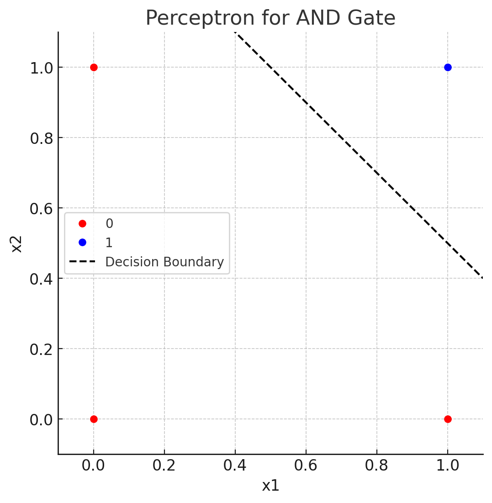

3주차 GMM

- [Book Chapter 2.](#book-chapter-2)
    - [📌 What is Perceptron?](#-what-is-perceptron)
      - [1. Definition of perceptron](#1-definition-of-perceptron)
      - [2. When bias added.](#2-when-bias-added)
    - [📌 AND, OR, XOR Gate](#-and-or-xor-gate)
      - [1. AND 게이트의 진리표](#1-and-게이트의-진리표)
      - [2. NAND 게이트의 진리표](#2-nand-게이트의-진리표)
      - [3. OR 게이트의 진리표](#3-or-게이트의-진리표)
    - [📌 Example of Perceptron in AND Gate](#-example-of-perceptron-in-and-gate)
- [Further Exploration: probabilistic machine](#further-exploration-probabilistic-machine)
    - [📌 확률론적 머신러닝이란?](#-확률론적-머신러닝이란)
      - [1. 원래의 관점](#1-원래의-관점)
      - [2. 확률론적 패러다임의 제기](#2-확률론적-패러다임의-제기)
      - [3. 확률론적 머신러닝의 정의](#3-확률론적-머신러닝의-정의)
    - [📌 MLE vs MAP](#-mle-vs-map)
      - [1. 베이즈 정리의 수학적 유도](#1-베이즈-정리의-수학적-유도)
      - [2. 각 parameter의 의미](#2-각-parameter의-의미)
      - [2. MLE?](#2-mle)
      - [3. MAP?](#3-map)
      - [4. MLE vs MAP](#4-mle-vs-map)
- [Reference](#reference)

# Book Chapter 2.

### 📌 What is Perceptron?

#### 1. Definition of perceptron

>퍼셉트론(perceptron)은 인공신경망의 한 종류로서, 1957년에 코넬 항공 연구소(Cornell Aeronautical Lab)의 프랑크 로젠블라트 (Frank Rosenblatt)에 의해 고안되었다. 이것은 가장 간단한 형태의 피드포워드(Feedforward) 네트워크, 선형분류기로도 볼 수 있다.

출처 : [퍼셉트론(위키백과)](https://ko.wikipedia.org/wiki/%ED%8D%BC%EC%85%89%ED%8A%B8%EB%A1%A0)

다수의 신호를 바탕으로 하나의 신호를 출력해내는 신경망이다. 수식적으로는 아래와 같이 표현할 수 있다.

$$
y = \begin{cases}
0 & (w_1x_1 + w_2x_2 \leq \theta) \\
1 & (w_1x_1 + w_2x_2 > \theta)
\end{cases}
$$

#### 2. When bias added.

하지만, $\theta$를 활용하여 매번 계산하기에는 불편함이 크다.

따라서, 편향 즉 bias를 설정하면, 간단한 수식으로 이를 표현할 수 있다.

$$
y = \begin{cases}
0 & (w_1x_1 + w_2x_2 + b \leq 0) \\
1 & (w_1x_1 + w_2x_2 + b > 0)
\end{cases}
$$

### 📌 AND, OR, XOR Gate

#### 1. AND 게이트의 진리표 
|$x_1$|$x_2$|y|
|---|---|---|
|0|0|0|
|0|1|0|
|1|0|0|
|1|1|1|

#### 2. NAND 게이트의 진리표 
|$x_1$|$x_2$|y|
|---|---|---|
|0|0|1|
|0|1|1|
|1|0|1|
|1|1|0|

#### 3. OR 게이트의 진리표 
|$x_1$|$x_2$|y|
|---|---|---|
|0|0|0|
|0|1|1|
|1|0|1|
|1|1|1|

### 📌 Example of Perceptron in AND Gate

다음과 같은 Perceptron을 설정한다면, AND 게이트의 데이터를 모두 분류할 수 있다는 것을 알 수 있다.

하지만, XOR 게이트의 경우는 어떨까?

.png)

> 이 경우에는 단순히 선형적 그래프로는 분류하기 힘들다.

이 경우에는, 비선형성을 추가하여 Perceptron을 구성하면, 해결할 수 있으며, 이 비선형성은 활성화함수를 통해 구현된다.

# Further Exploration: probabilistic machine

### 📌 확률론적 머신러닝이란?

먼저, 확률론적 머신러닝이 속하고 있는 범주에 대해서 알아야할 필요가 있다. 이는 단지 머신러닝을 바라보는 관점일 뿐이다.

#### 1. 원래의 관점

초기 머신러닝은, 결정론적 / 알고리즘적 접근 방법으로 데이터는 완전하고 오류가 없으며, 단 하나의 정답이 존재한다고 가정한다.

🧠 철학 : “모델은 정확하게 데이터를 설명하는 수식 또는 규칙이어야 한다.”

📌 문제점

- 현실의 데이터는 노이즈, 결측치, 불확실성을 내포하고 있음
- 고정된 결정론적 규칙으로는 불확실한 상황에서 합리적인 예측을 하기 어려움
- 예: "이 이메일이 스팸일 확률은?" 같은 문제는 이분법적 답변보다 확률적 해석이 자연스러움

#### 2. 확률론적 패러다임의 제기

따라서, 핵심적인 동기는
"불확실성을 다루기 위해서."임.

머신러닝을 **관측된 데이터를 바탕으로 모델을 추론하는 것**으로 설명하며,현실 세계에서는 **데이터도 불완전하고, 모델도 불확실**하기 때문에 확률론이 필수적이라고 주장함.

그럼 원래 패러다임은 폐기되었는가? 

기존의 딥러닝, 최적화 기반 학습 등은 **불확실성을 명시적으로 다루지는 않지만, 데이터가 충분히 많고 확률적 해석이 굳이 필요 없는 문제**에서는 매우 효과적임.

#### 3. 확률론적 머신러닝의 정의

즉, "**확률론적 머신러닝은 불확실성을 포함한 모든 문제를 확률 이론에 기반하여 모델링하고 추론하는 체계적인 접근 방식**"이라고 할 수 있다. 이 정의는 단순히 "확률 분포를 다룬다"는 것 이상으로, **모델의 구조, 파라미터, 예측에 존재하는 모든 종류의 불확실성을 수학적으로 표현하고, 그로부터 추론하는 방법론 전체를 포괄**한다.

### 📌 MLE vs MAP

#### 1. 베이즈 정리의 수학적 유도

두 개념을 살펴보기에 앞서, 베이즈 정리를 수학적으로 이해해야할 필요가 있다. 현대 확률론에서 가장 큰 부분을 차지하고 있으며, 이를 이해하는 것은 후에 설명할 내용을 이해하는데 기본이 된다.

먼저, **베이즈 정리**의 기본 형태를 알아보자.

$$
P(\theta | D) = \frac{P(D|\theta) * P(\theta)}{P(D)}
$$

여기서,

- $\theta$ : 모델의 파라미터 (ex: 어떤 조건일 확률)
- $D$ : 관측된 데이터
- $P(\theta|D)$: 사후 확률 (posterior)
- $P(D|\theta)$: 우도 (likelihood)
- $P(\theta)$: 사전 확률 (prior)
- $P(D)$: 증거(evidence) 또는 정규화 상수

💡 유도

베이즈 정리는 조건부 확률의 정의에서부터 출발한다.

- 조건부 확률의 정의
  
$$
P(A|B) = \frac{P(A \cap B)}{P(B)}
$$

- 마찬가지로,

$$
P(B|A) = \frac{P(B \cap A)}{P(A)}
$$

두 식의 분자 $P(A \cap B) = P(B \cap A)$ 이므로,

$$
P(A|B) = \frac{P(B|A) * P(A)}{P(B)}
$$

여기서 $A = \theta, B = D$로 치환하면 바로:

$$
P(\theta|D) = \frac{P(D|\theta) * P(\theta)}{P(D)}
$$

#### 2. 각 parameter의 의미

**베이즈 정리**의 기본 형태에서,

$$
P(\theta | D) = \frac{P(D|\theta) * P(\theta)}{P(D)}
$$

- $\theta$ : 모델의 파라미터 (ex: 어떤 조건일 확률)
- $D$ : 관측된 데이터
- $P(\theta|D)$: 사후 확률 (posterior)
- $P(D|\theta)$: 우도 (likelihood)
- $P(\theta)$: 사전 확률 (prior)
- $P(D)$: 증거(evidence) 또는 정규화 상수

이 각 파라미터의 의미를 파악하는 것이 확률론적 머신러닝을 이해하는 데 핵심이 될 수 있다.

따라서, 큰 예시를 하나 들고, 이를 바탕으로 각 개념을 설명해보겠다.

✅ 목표설정 \
먼저, 우리가 하고 싶은 일은, 머신러닝에서 **"가장 그럴듯한 모델"**을 찾고 싶은 것이다. 즉, 데이터 D를 봤을 때, 어떤 모델 $\theta$가 가장 가능성 있냐? 를 알고싶은 것이다.

✅ $\theta$ : 모델의 파라미터\
예를 들어, 어떤 사람이 이메일을 열 확률을 $\theta$라고 하자.\
우리는 $\theta$의 값을 모르지만, 알고 싶다.\
이게 우리가 모델링하고 추정하고 싶은 미지수라고 할 수 있다.

✅ $D$ : 관측된 데이터\
만약, 어떤 사람이 10개의 이메일 중 7개를 열었다고 하자.\
그럼 이게 우리가 실제로 본 데이터 $D$인 것이다.

✅ $P(\theta)$: 사전 확률 (prior)
> 관측을 하기 전, 우리가 $\theta$에 대해 기존에 가지고 있던 믿음이다.

예를 들어,
- "아무런 정보도 없다" -> $\theta \sim \mathrm{Uniform}(0, 1)$
- "이 사람은 보통 50%는 메일을 열더라" -> $\theta \sim \mathrm{Beta}(5, 5)$

($\mathrm{Uniform}$은 균등 분포,$\mathrm{Beta}$는 베타 분포)

✅ $P(D|\theta)$: 우도 (likelihood)
> $\theta$라는 값이 맞다고 가정했을 때, 우리가 실제 본 데이터 $D$가 얼마나 그럴듯한가?

예를 들어,
- "메일을 70% 확률로 연다고 가정했을 때, 10개 중 7개를 여는 건 자연스러운가?"
- 이 확률은 베르누이/이항 분포로 계산함.
  
✅ $P(D)$: 증거(evidence) 또는 정규화 상수

전체적으로 데이터 $D$가 관측될 총 가능성

$$
P(D) = \int P(D|\theta) P(\theta) d\theta
$$

- 사실 이건 정규화 상수로 사용됨.
- 사후 확률 $P(\theta|D)$의 분모인데, 없어도 비레 관계로는 문제가 되지 않는다.

✅ $P(\theta|D)$: 사후 확률 (posterior)

데이터 $D$ 를 관측한 후, $\theta $에 대해 우리가 믿게 된 새로운 확률 분포

- 즉, **기존의 믿음 (prior)**을 가지고 있다가, 
- **새로운 데이터(liklihood)**를 보고 나서,
- 그것을 **업데이트(post-update)**한 것이 **posterior**
  
📦 직관적 예시: 베이지안 이메일 사용자
- $\theta$: 사용자가 메일을 열 확률
- $P(\theta)$: “그 사람은 대충 50% 정도 여는 사람일 거야”
- $D$: 10개 중 7개 열었음
- $P(D|\theta)$: "만약 이 사람이 60% 확률로 메일을 연다면, 이런 데이터(7개 열기)는 얼마나 자연스러울까?"
- $P(\theta|D)$: 이 모든 걸 보고 난 뒤에, 이제 메일을 열 확률은 70%쯤 되겠네 라고 업데이트

#### 2. MLE?

🔭 maximum **likelihood** estimation\
🔭 $\theta$를 고정된 값으로 생각함.\
🔭 데이터의 likelihood 값을 최대화 하는 방향

#### 3. MAP?

🔭 maximum **A posterior** estimation\
🔭 $\theta$를 확률 변수로 생각함.\
🔭 데이터의 posterior 값을 최대화 하는 방향

$$
(posterior = \frac{liklihood * prior}{evidence}, posterior \propto liklihhod * prior)
$$

#### 4. MLE vs MAP

|항목|MLE|MAP|
|---|---|---|
|목적|데이터를 가장 잘 설명하는 $\theta$ 추정|데이터 + 사전 지식을 고려해 $\theta$ 추정|
|수식|$\theta_{MLE} = \argmax_{\theta}{P(D\|\theta)}$|$\theta_{MAP} = \argmax_{\theta}{P(\theta\|D)} = \argmax_{\theta}{P(D \|\theta)P(\theta)}$|
|사용 정보|관측 데이터만 사용|관측 데이터 + 사전 확률 사용|
|관점|빈도주의적(Frequentist): $\theta$는 고정값|베이지안(Bayesian): $\theta$는 확률변수|

$$
\underbrace{\hat{\theta}_{\text{MAP}}}_{\text{사후 확률 최댓값}} = \arg\max_{\theta} \underbrace{P(D \mid \theta)}_{\text{우도}} \cdot \underbrace{P(\theta)}_{\text{사전 확률}}
$$

MAP는 MLE의 확장 형태라고 볼 수도 있음.

- 만약 $P(\theta) = \text{상수}$라면, MAP = MLE

✅ 장단점

|항목|MLE|MAP|
|---|---|---|
|장점|간단하고 직관적, 계산 쉬움|소량 데이터에서 강력, prior로 안정성 up|
|단점|과적합 위험, 사전 지식 반영 불가|prior가 잘못되면 편향 가능|
|일반화|데이터 많을수록 일반화가 잘됨|데이터가 적어도 잘 작동|
|확률 해석|확률적 해석 불가|베이즈 관점에서 확률적 해석 가능|

# Reference

[밑바닥부터 시작하는 딥러닝 - 사이토 코키](https://product.kyobobook.co.kr/detail/S000215599933)

[머신러닝: MLE, MAP (by.@houtsun1508 in velog)](https://velog.io/@hotsun1508/%EB%A8%B8%EC%8B%A0%EB%9F%AC%EB%8B%9D-MLE-MAP)

