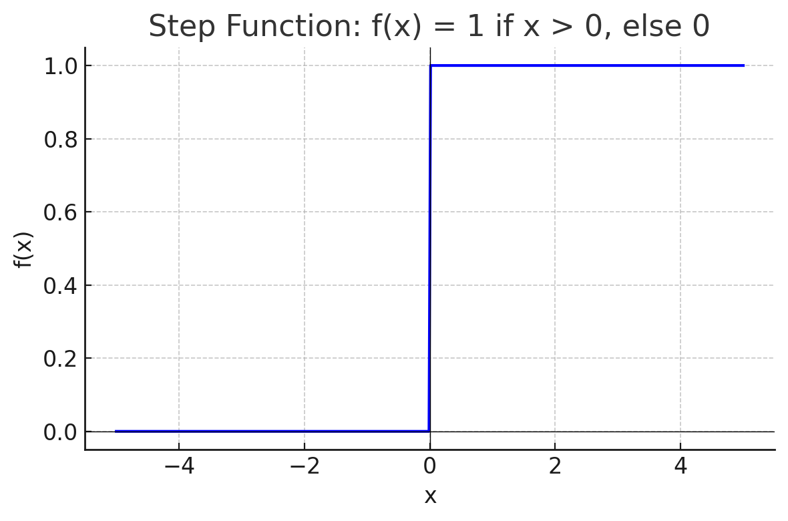
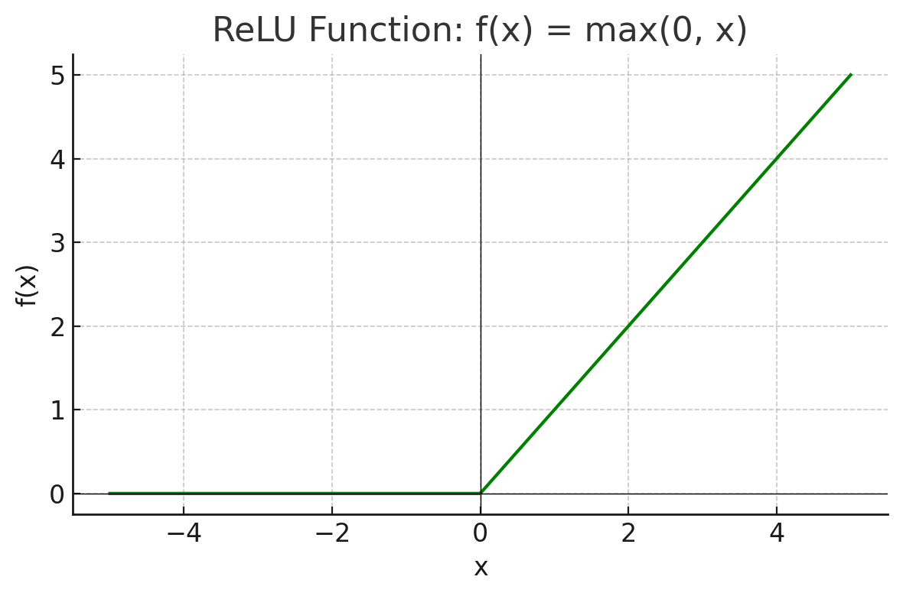
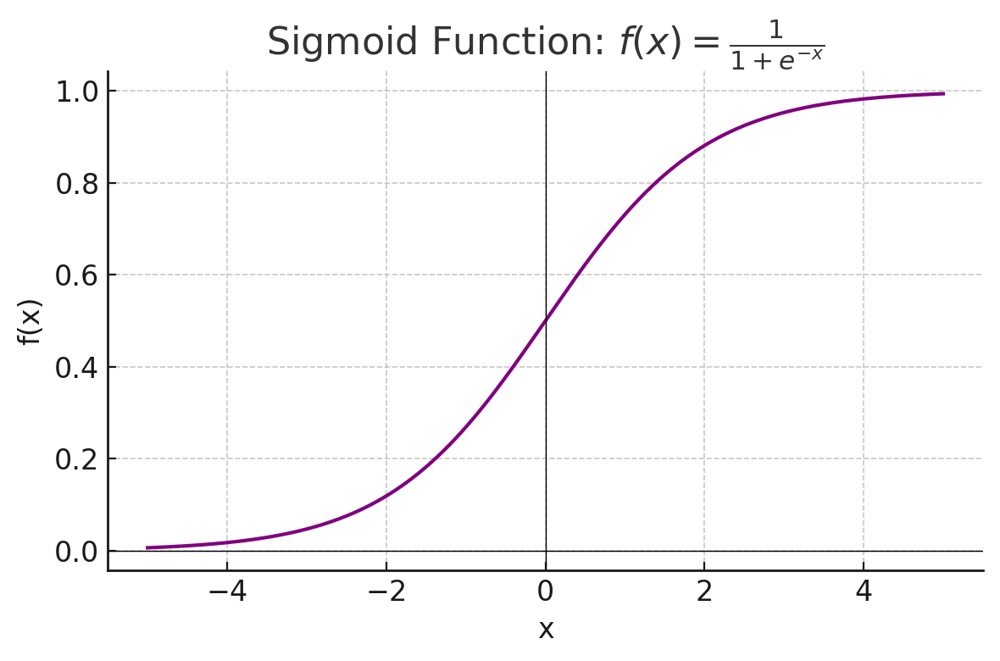
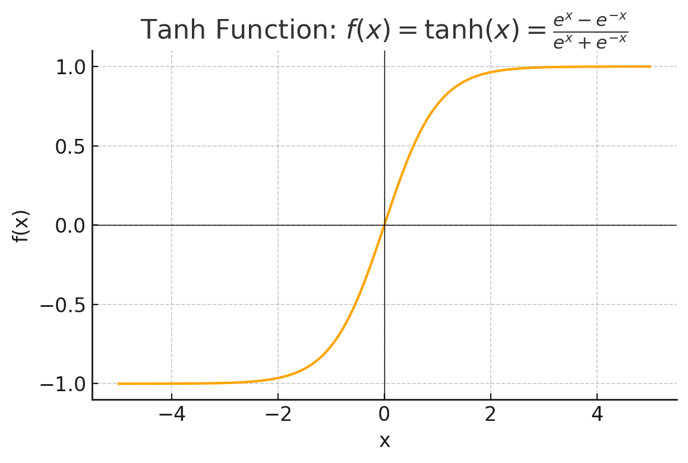

- [Book Chapter 3.](#book-chapter-3)
    - [📌 What is Activation Function](#-what-is-activation-function)
      - [1. Definition of Activation Function](#1-definition-of-activation-function)
    - [📌 Sort of Activation Function](#-sort-of-activation-function)
      - [1. Step Function](#1-step-function)
      - [2. ReLU Function](#2-relu-function)
      - [3. Sigmoid Function](#3-sigmoid-function)
      - [4. Tanh Function](#4-tanh-function)
      - [5. Softmax Function](#5-softmax-function)
- [Further exploration : Data](#further-exploration--data)
    - [📌 Tablur Data](#-tablur-data)
    - [📌 Time-series Data](#-time-series-data)

# Book Chapter 3.

### 📌 What is Activation Function

#### 1. Definition of Activation Function

> 입력 신호의 총합을 출력 신호로 변환하는 함수를 일반적으로 활성화 함수라고 한다.

앞서 살펴보았던 XOR 문제를 해결하기 위해, 비선형성을 모델에 추가해야될 필요가 있었다. 이를 위해서, 활성화 함수를 추가하여 모델을 만들었고 비선형성이 확보되었다.

만약, 활성화 함수가 없다면 다층 퍼셉트론에서 층을 깊게 쌓는 것의 의미가 없어진다. 아래 예시를 보자.

만약, 어떤 퍼셉트론이 
$$
y = w_1x_1
$$
의 식을 가진다고 보자. 이는, 입력 $x_1$를 한개의 층을 통과시켜 만들어낸 퍼셉트론이다. 만약, 활성화 함수를 사용하지 않고 층을 많이 쌓으면 어떤 경우가 생기는지 알아보자.

$$
y = w_1w_2w_3\cdots{}w_nx_1
$$

보기에는 복잡한 식이 만들어진 것 같지만, $w_1w_2w_3\cdots{}w_n$은 결국 하나의 가중치 $w$와 다를 것이 없으므로,
$$
y=wx
$$
와 다를 것이 없다.

### 📌 Sort of Activation Function

#### 1. Step Function

$$
f(x) = 
\begin{cases}
1 & \text{if } x > 0 \\
0 & \text{if } x \leq 0
\end{cases}
$$

Step Function (계단 함수)는 출력이 임계값을 넘으면 1, 낮으면 0이 되는 함수이다. 비선형성을 가지고 있다. 이 함수는 미분이 불가능할뿐더러, 만약 임계값이 아닌 구간에서 미분을 한다고 하더라도, 그 값이 0으로 역전파 과정에서 아무 의미가 없는 결과가 나오기 때문에 사용하지 않는다.

주로, 퍼셉트론, 이진 분류기, 디지털 회로, 계단 활성화 함수에서 사용된다.

#### 2. ReLU Function

$$
f(x) = \max(0, x)
$$
$$
f(x) = 
\begin{cases}
0 & \text{if } x \leq 0 \\
x & \text{if } x > 0
\end{cases}
$$

ReLU(Rectified Linear Unit) 함수는, 현재 가장 널리 사용되고 있는 활성화 함수이다. 함수 또한 그리 간단하지 않은 것이 특징이다. 0보다 크면 그대로의 값을 출력하고, 0보다 작으면 0의 값을 출력한다.

오차 역전파를 할때, 0보다 작은 값에서는 0을 가지며, 0보다 큰 값은 1을 출력하게된다. 이렇게되면 기울기 소실이 덜 일어나기 때문에 널리 사용되는 활성화 함수이기도 하다.

#### 3. Sigmoid Function

$$
f(x) = \frac{1}{1 + e^{-x}}
$$

이진 분류에 주로 활용되는 모델이다. 앞선 모델들은 모델의 신뢰성을 정확하게 표현할 수는 없지만, 이 활성화 함수를 사용하면 모델의 정확도를 표현할 수 있기에 장점이 있다.

#### 4. Tanh Function

$$
f(x) = \tanh(x) = \frac{e^x - e^{-x}}{e^x + e^{-x}}
$$

이 함수는, Sigmoid랑 비슷하지만, 기울기의 최댓값이 Sigmod 함수에 비해서 크기 때문에 역전파 과정을 실행했을 때 Gradient Vanishing을 해결할 수 있음.

#### 5. Softmax Function

*sigmoid 함수는 그래프로 나타내기는 어렵다.

$$
\mathrm{softmax}(x_i) = \frac{e^{x_i}}{\sum_{j} e^{x_j}}
$$

다중 분류를 위한 활성화 함수이다. 앞선 sigmoid 함수는 이중 분류만 가능했지만, softmax는 다양한 label에 대한 확률 값을 표현할 수 있어, 널리 활용된다.

# Further exploration : Data

❗️각 데이터 범주는 구분된 것이 아니다. Tablur Data 속에 Time-series 데이터가 포함되기도 한다.
### 📌 Tablur Data

다양한 자료형이 표현되어있는 Data이다. boolean, num과 같은 자료형과, label (정답)이 포함되어 있다.

보통, 결측치, 이상치와 같은 값이 데이터에 포함되기도 하는데, 이러한 값들을 잘 처리하는 것이 모델의 정확도에 큰 영향을 미치기도 한다.

색깔과 같은 column은 one-hot 인코딩과 같은 방법을 활용해 처리하기도 한다.

| Order ID | Product     | Category   | Quantity | Price | Total   | Date       |
|----------|-------------|------------|----------|-------|---------|------------|
| 1001     | Notebook    | Stationery | 3        | 2.50  | 7.50    | 2025-04-01 |
| 1002     | Pen Set     | Stationery | 2        | 5.00  | 10.00   | 2025-04-01 |
| 1003     | Mouse       | Electronics| 1        | 15.00 | 15.00   | 2025-04-02 |
| 1004     | USB Drive   | Electronics| 4        | 8.00  | 32.00   | 2025-04-03 |
| 1005     | Water Bottle| Lifestyle  | 2        | 10.00 | 20.00   | 2025-04-03 |

### 📌 Time-series Data

시계열 데이터라고 부른다.
시간에 따라 변화하는 값을 주로 표현하는데 주로 RNN이 사용되게 된다.

| Date       | Temperature (°C) |
|------------|------------------|
| 2025-04-01 | 15.2             |
| 2025-04-02 | 16.5             |
| 2025-04-03 | 14.8             |
| 2025-04-04 | 13.9             |
| 2025-04-05 | 15.6             |
| 2025-04-06 | 17.1             |
| 2025-04-07 | 16.3             |
