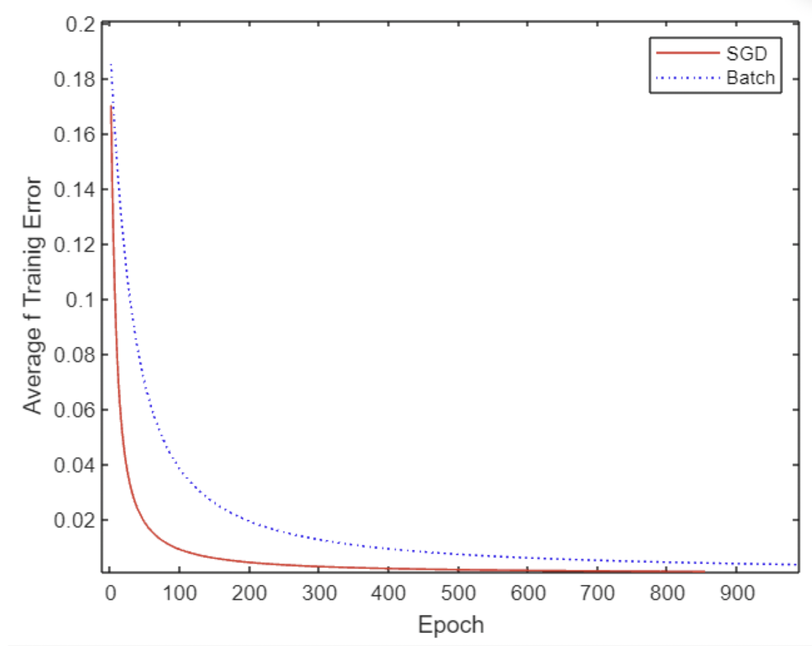

- [Book Chapter 4.](#book-chapter-4)
    - [📌 What is Loss Function](#-what-is-loss-function)
      - [1. Definition of Loss Function](#1-definition-of-loss-function)
    - [📌 What is Optimizer](#-what-is-optimizer)
      - [2. Optimizer](#2-optimizer)
        - [2-1. 기본형: Gradient Descent (GD)](#2-1-기본형-gradient-descent-gd)
          - [2-1-1. Batch Gradient Descent](#2-1-1-batch-gradient-descent)
          - [2-1-2. Stochastic Gradient Descent (SGD)](#2-1-2-stochastic-gradient-descent-sgd)
          - [2-1-3. BGD vs SGD](#2-1-3-bgd-vs-sgd)
        - [2-2. 모멘텀 계열 optimizer](#2-2-모멘텀-계열-optimizer)
          - [2-2-1. Momentum](#2-2-1-momentum)
          - [2-2-2. Nesterov Accelerated Gradient](#2-2-2-nesterov-accelerated-gradient)
        - [2-3. 적응형 학습률 optimizer](#2-3-적응형-학습률-optimizer)
          - [2-3-1. Adagrad](#2-3-1-adagrad)
          - [2-3-2. RMSprop](#2-3-2-rmsprop)
          - [2-3-3. Adadelta](#2-3-3-adadelta)
        - [2-4. Adam 계열](#2-4-adam-계열)
          - [2-4-1. Adam (Adaptive Moment Estimation)](#2-4-1-adam-adaptive-moment-estimation)
          - [2-4-2. Adamax](#2-4-2-adamax)
          - [2-4-3. Nadam](#2-4-3-nadam)
        - [2-5. 최근 고급 Optimizer](#2-5-최근-고급-optimizer)
- [Reference](#reference)


# <span style="color:red">Book Chapter 4.</span>

### 📌 What is Loss Function

#### 1. Definition of Loss Function

Loss Function은 우리가 만든 모델의 예측값이 실제 데이터와 차이가 얼마나 나는지 수치적으로 정량화한 지표이다.

학습, 즉 fitting을 진행할 때, 우리는 input data x와 output data y 사이의 관계 (mapping)을 찾아가게 된다. 이 과정에서 가중치를 조정하게 되며, loss function이 적절한 가중치를 찾아가는 방향을 제시하게 되는 것이다.

### 📌 What is Optimizer

#### 2. Optimizer

loss를 줄이는 방향으로 학습을 진행시키는 알고리즘을 optimizer라고 한다. 그럼 어떤 optimizer가 있을까?


##### 2-1. 기본형: Gradient Descent (GD)

###### 2-1-1. Batch Gradient Descent

- 전체 데이터셋을 기준으로 한 번의 경사 하강
- 장점 : 수렴 안정적.
- 단점 : 대규모 데이터에선 느림, 메모리 사용량 큼.
  
```Matlab
% This code is written by Matlab
function W = DeltaBatch(W, X, D)
    alpha =0.9;
    dWsum = zeros(3, 1);
    N =4;
    for k =1:N
        x = X(k, :);
        d = D(k);
        
        v = W*x;
        y = Sigmoid(v);
        e = d - y;
        delta = y*(1-y)*e
        dW = alpha * delta * x;
        
        dWsum = dWsum + dW;
    end
    dWavg = dWsum / N;
    W(1) = W(1) + dWavg(1);
    W(2) = W(2) + dWavg(2);
    W(3) = W(3) + dWavg(3);
end
```

###### 2-1-2. Stochastic Gradient Descent (SGD)

- 데이터 하나(샘플)마다 가중치 갱신.
- 장점 : 메모리 효율적, 빠른 업데이트.
- 단점 : 진동이 심하고 최적점 근처에서 불안정.

```Matlab
% This code is written by Matlab
function W = DeltaSGD(W, X, D)
    alpha =0.9;
    N =4;
    for k =1:N
        x = X(k, :);
        d = D(k);
        v = W*x;
        y = Sigmoid(v);
        e = d - y;
        delta = y*(1-y)*e;
        dW = alpha*delta*x;
        W(1) = W(1) + dW(1);
        W(2) = W(2) + dW(2);
        W(3) = W(3) + dW(3);
    end
end
```

###### 2-1-3. BGD vs SGD

아래와 같은 코드를 통해 두 모델을 활용해 학습을 진행하고, 이들 사이의 차이점을 찾아보자. 
```Matlab
% This code is written by Matlab
X = [0 0 1;
      0 1 1;
      1 0 1;
      1 1 1;
    ];
D = [0
    0
    1
    1
    ];
E1 = zeros(1000,1); 
E2 = zeros(1000,1);
W1 =2*rand(1, 3) -1;
W2 = W1;
for epoch =1:1000
    W1 = DeltaSGD(W1, X, D);
    W2 = DeltaBatch(W2, X, D);
    es1 =0;
    es2 =0;
    N =4;
    for k =1:N
        x = X(k, :);
        d = D(k);
        
        disp(size(x));
        disp(size(W1));
        v1 = W1*x;
        y1 = Sigmoid(v1);
        es1 = es1 + (d-y1)^2;
        v2 = W2*x;
        y2 = Sigmoid(v2);
        es2 = es2 + (d-y2)^2;
    end
    E1(epoch) = es1 / N;
    E2(epoch) = es2 / N;
end
plot(E1, "r")
hold on
plot(E2, 'b:')
xlabel('Epoch')
ylabel('Average f Trainig Error')
legend('SGD', 'Batch')
```

결과적으로 나온 결과는 다음과 같다.



##### 2-2. 모멘텀 계열 optimizer

무엇을 위한 것인가?

-> 진동 억제, 수렴 가속을 위해 과거의 방향성을 고려한 최적화 도입


###### 2-2-1. Momentum

- 과거 기울기의 이동 평균을 이용해 방향 유지, 이름처럼 "관성"을 주는 방식임. 이전에 갔던 방향을 기억해서, 그 방향으로 더욱 밀어주는 느낌.
- 장점 : 경사 진동 억제, 수렴 속도 증가 (이는 기울기가 왔다갔다 하면서도 흐름을 유지하면서 더 빨리갈 수 있기 때문)
- 수식 : 
$$
\begin{align*}
v_t &= \gamma v_{t-1} + \eta \nabla J(\theta) \\
\theta &= \theta - v_t
\end{align*}
$$

###### 2-2-2. Nesterov Accelerated Gradient

- 기존의 Momentum 방식은 기울기를 업데이트하고, momentum만큼 점프하는 반면, 이 방식은 momentum만큼 점프하고, 기울기를 업데이트한다.
- 장점 : 더 똑똑하게 방향을 잡음 → 더 빠르고 정확한 수렴 가능.

##### 2-3. 적응형 학습률 optimizer

###### 2-3-1. Adagrad

- 파라미터마다 다른 속도로 학습함.
- 자주 등장하는 변수는 업데이트를 줄이고, 드문 변수는 자주 바꾼다.
- 어떻게 파라미터마다 등장하는 횟수가 다를 수 있는가? => 즉 얼마나 업데이트되는지, 그 횟수를 계산해두고 이를 바탕으로 업데이트함.
- 단점 : 학습률이 점점 너무 작아져서 학습이 멈추는 경우도 있음.
  
###### 2-3-2. RMSprop

- Adagrad가 배움의 양을 누적하기 때문에 나중에 멈추는 문제를 해결하기 위해 등장
- RMSprop은 최근 것들만 중요하게 봄. (과거의 것은 잊고 지나감.)
- 장점 : 학습이 멈추지않고 오래 유지됨. -> RNN에서 유리

###### 2-3-3. Adadelta

- RMSprop을 발전시킨 형태, 학습률 자체도 자동으로 조정함.
- 장점 : 사람이 직접 학습률을 정할 필요가 없음.

##### 2-4. Adam 계열

###### 2-4-1. Adam (Adaptive Moment Estimation)

- Momentum과 RMSprop을 합친 것!
- 방향성도 기억하고 변수별로 속도도 다르게 설정함.
- 장점 : 거의 모든 상황에서 좋은 성능을 가지며, 그래서 기본값처럼 자주 사용됨.

###### 2-4-2. Adamax

- Adam의 버전 중 하나인데 특이값이나 큰 값에 더 강함.
- L2가 아니라 L$\infin$(가장 큰 값 기준)으로 조절함.
- 장점 : 안정성 증가, 큰 값에 대한 민감도 줄어듦

###### 2-4-3. Nadam

- Adam + NAG (예측 기반 업데이트)
- Adam이 좋긴 한데, '예측해서 움직이는' 영리함까지 추가된 느낌
- 장점 : 더 부드럽고 빠르게 수렴.

##### 2-5. 최근 고급 Optimizer

- AMSGrad
- AdaBound (2019)
- Lookahead (2019)
- Lion (2023, Meta AI)

# Reference

[밑바닥부터 시작하는 딥러닝 - 사이토 코키](https://product.kyobobook.co.kr/detail/S000215599933)

[딥러닝 첫걸음 - 김성필](https://product.kyobobook.co.kr/detail/S000001057884)